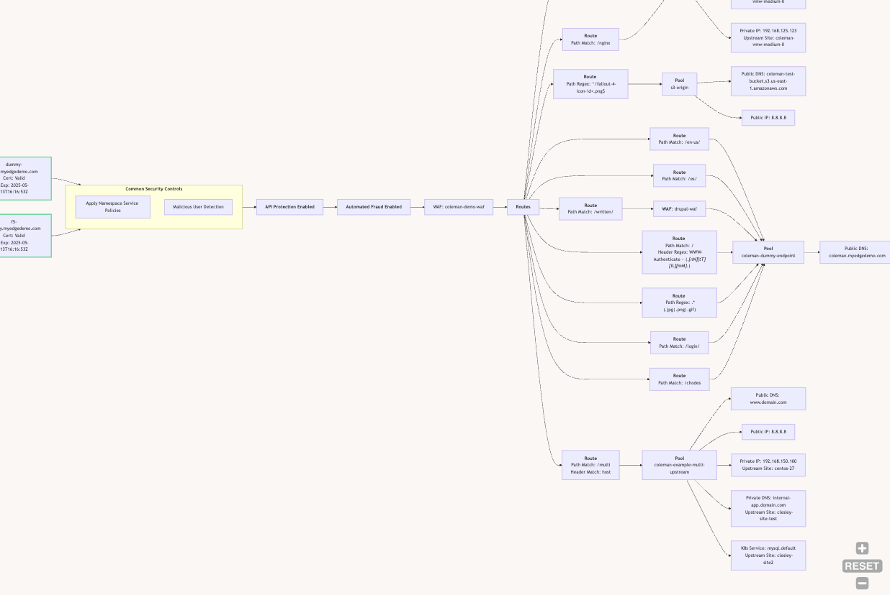

# xcshowmap

A command-line tool to visualize service flow from F5 XC by querying API endpoints and generating Mermaid diagrams.

## Installation

Clone the repository and build the binary:

```bash
git clone https://github.com/yourusername/xcshowmap.git
cd xcshowmap
go build -o xcshowmap
```

Or run directly with:

```bash
go run main.go -api-url <API_URL> -token <TOKEN> -namespace <NAMESPACE> -load-balancer <LB>
```

## Usage

```bash
xcshowmap -api-url <API_URL> -token <TOKEN> -namespace <NAMESPACE> -load-balancer <LOAD_BALANCER_NAME> [-debug]
```

### Arguments

| Flag            | Description                                      | Required |
|----------------|------------------------------------------------|----------|
| `-api-url`     | Base API URL to query F5 XC                    | ✅ Yes   |
| `-token`       | API Token for authentication                   | ✅ Yes   |
| `-namespace`   | Namespace of the Load Balancer                 | ✅ Yes   |
| `-load-balancer` | Load Balancer name to inspect               | ✅ Yes   |
| `-debug`       | Prints raw JSON API responses for debugging    | ❌ No    |

## Example Usage

### Basic Command

```bash
xcshowmap -api-url "<https://example.api.f5.com>" -token "your_api_token" -namespace "your-namespace" -load-balancer "your-load-balancer"
```

### Debug Mode

```bash
xcshowmap -api-url "<https://example.api.f5.com>" -token "your_api_token" -namespace "your-namespace" -load-balancer "your-load-balancer" -debug
```

(Debug mode prints raw API responses for troubleshooting.)

### Example Output

#### Command

```bash
xcshowmap -api-url "<https://api.f5xc.com>" -token "my_token" -namespace "my-namespace" -load-balancer "loadbalancer"
```

### Mermaid Diagram Output

```sql
graph LR;
    User -->|SNI| LoadBalancer;
    LoadBalancer -->|dummy.myedgedemo.com| dummy.myedgedemo.com;
    dummy.myedgedemo.com --> ServicePolicies;
    LoadBalancer -->|dummy.myedgedemo.com| dummy.myedgedemo.com;
    dummy.myedgedemo.com --> ServicePolicies;
    ServicePolicies --> demo-waf;
    coleman-demo-waf -->|Routes Evaluated| Routes;
    Routes -->|/api/v1/data| route_1;
    route_1 --> pool_main-backend;
    pool_main-backend --> 192.168.1.10;
```

### Diagram Rendering



To visualize the diagram, copy the Mermaid output into an online Mermaid editor like: 🔗 [Mermaid Live Editor](https://mermaid.live/)

### Features

- Generates Service Flow from F5 XC API
- Queries Load Balancer & Origin Pools
- Displays WAF & Service Policies in Diagram
- Supports Regex & Prefix-based Routes
- Shows User Flow & Domains in Diagram
- Debug Mode for Raw API Output

### To Do

- add additional security services
- evaluate CDN existence / match upstream domain
