# xcshowmap

A command-line tool to visualize service flow from F5 XC by querying API endpoints and generating Mermaid diagrams.

## Installation

Clone the repository and build the binary:

```bash
git clone https://github.com/yourusername/xcshowmap.git
cd xcshowmap/cmd/xcshowmap
go build -o xcshowmap
```

Or run directly with:

```bash
go run main.go -api-url <API_URL> -token <TOKEN> -namespace <NAMESPACE> -load-balancer <LB>
```

## Usage

```bash
xcshowmap -api-url <API_URL> -token <TOKEN> -namespace <NAMESPACE> -load-balancer <LOAD_BALANCER_NAME> [-debug]
```

### Arguments

| Flag            | Description                                      | Required |
|----------------|------------------------------------------------|----------|
| `-api-url`     | Base API URL to query F5 XC                    | ✅ Yes   |
| `-token`       | API Token for authentication                   | ✅ Yes   |
| `-namespace`   | Namespace of the Load Balancer or all          | ✅ Yes   |
| `-load-balancer` | Load Balancer name to inspect or all           | ✅ Yes   |
| `-debug`       | Prints raw JSON API responses for debugging    | ❌ No    |
| `-batch`       | Save output as raw mermaid file under <br> a *namespace*/*loadbalancer*.mmd structure        | ❌ No    |


## Example Usage

### Basic Command

```bash
xcshowmap -api-url "<https://example.api.f5.com>" -token "your_api_token" -namespace "your-namespace" -load-balancer "your-load-balancer"
```

### To list all Namespace LBs
```bash
xcshowmap -api-url "<https://example.api.f5.com>" -token "your_api_token" -namespace "your-namespace" -load-balancer "all"
```

### Debug Mode

```bash
xcshowmap -api-url "<https://example.api.f5.com>" -token "your_api_token" -namespace "your-namespace" -load-balancer "your-load-balancer" -debug
```

(Debug mode prints raw API responses for troubleshooting.)

### Batch Mode

```bash
xcshowmap -api-url "<https://example.api.f5.com>" -token "your_api_token" -namespace "your-namespace" -load-balancer "all" -batch
```

(Batch mode will output raw mermaid output in a folder structure across an entire namespace or an entire tenant)

### Example Output

#### Command

```bash
xcshowmap -api-url "<https://api.f5xc.com>" -token "my_token" -namespace "my-namespace" -load-balancer "loadbalancer"
```

### Mermaid Diagram Output

```sql
graph LR;
    User -->|SNI| LoadBalancer;
    LoadBalancer -->|dummy.myedgedemo.com| dummy.myedgedemo.com;
    dummy.myedgedemo.com --> ServicePolicies;
    LoadBalancer -->|dummy.myedgedemo.com| dummy.myedgedemo.com;
    dummy.myedgedemo.com --> ServicePolicies;
    ServicePolicies --> demo-waf;
    coleman-demo-waf -->|Routes Evaluated| Routes;
    Routes -->|/api/v1/data| route_1;
    route_1 --> pool_main-backend;
    pool_main-backend --> 192.168.1.10;
```

### Diagram Rendering

```mermaid
---
title: F5 Distributed Cloud Load Balancer Service Flow
---
graph TB;
    User --> LoadBalancer;
    LoadBalancer["**Public Load Balancer**"];
    classDef certValid stroke:#01ba44,stroke-width:2px;
    classDef certWarning stroke:#DAA520,stroke-width:2px;
    classDef certError stroke:#B22222,stroke-width:2px;
    LoadBalancer -- SNI --> domain_dummy-f5sa_myedgedemo_com["dummy-f5sa.myedgedemo.com<br> Cert: Valid <br> Exp: 2025-05-13T16:16:53Z"];
    class domain_dummy-f5sa_myedgedemo_com certValid;
    LoadBalancer -- SNI --> domain_f5-dummy_myedgedemo_com["f5-dummy.myedgedemo.com<br> Cert: Valid <br> Exp: 2025-05-13T16:16:53Z"];
    class domain_f5-dummy_myedgedemo_com certValid;
    domain_dummy-f5sa_myedgedemo_com --> ServicePolicies;
    domain_f5-dummy_myedgedemo_com --> ServicePolicies;
    subgraph ServicePolicies ["**Common Security Controls**"]
        direction LR
        sp_ns["Apply Namespace Service Policies"];
        mud["Malicious User Detection"];
    end
    ServicePolicies --> api_protection["**API Protection Enabled**"];
    api_protection["**API Protection Enabled**"] --> bot_defense["**Automated Fraud Enabled**"];
    bot_defense["**Automated Fraud Enabled**"] --> waf_coleman-demo-waf["WAF: coleman-demo-waf"];
    waf_coleman-demo-waf["WAF: coleman-demo-waf"] --> Routes;
    Routes["**Routes**"];
    DefaultRoute["**Default Route**"];
    Routes --> DefaultRoute;
    DefaultRoute --> pool_coleman-nginx-cluster-local["**Pool**<br>coleman-nginx-cluster-local"];
    pool_coleman-nginx-cluster-local["**Pool**<br>coleman-nginx-cluster-local"] --> node_1[""Private IP: 192#46;168#46;125#46;121<br> Upstream Site: coleman-vmw-medium-0""];
    pool_coleman-nginx-cluster-local["**Pool**<br>coleman-nginx-cluster-local"] --> node_2[""Private IP: 192#46;168#46;125#46;122<br> Upstream Site: coleman-vmw-medium-0""];
    pool_coleman-nginx-cluster-local["**Pool**<br>coleman-nginx-cluster-local"] --> node_3[""Private IP: 192#46;168#46;125#46;123<br> Upstream Site: coleman-vmw-medium-0""];
    route_0["**Route** <BR> Path Regex: ^/fallout-4-icon-\d+\.png$"];
    Routes --> route_0;
    route_0 --> pool_s3-origin["**Pool**<br>s3-origin"];
    pool_s3-origin["**Pool**<br>s3-origin"] --> node_4[""Public DNS: coleman-test-bucket#46;s3#46;us-east-1#46;amazonaws#46;com""];
    pool_s3-origin["**Pool**<br>s3-origin"] --> node_5[""Public IP: 8#46;8#46;8#46;8""];
    route_3["**Route** <BR> Path Match: /en-us/"];
    Routes --> route_3;
    route_3 --> pool_coleman-dummy-endpoint["**Pool**<br>coleman-dummy-endpoint"];
    pool_coleman-dummy-endpoint["**Pool**<br>coleman-dummy-endpoint"] --> node_6[""Public DNS: coleman#46;myedgedemo#46;com""];
    route_4["**Route** <BR> Path Match: /es/"];
    Routes --> route_4;
    route_4 --> pool_coleman-dummy-endpoint["**Pool**<br>coleman-dummy-endpoint"];
    route_5["**Route** <BR> Path Match: /written/"];
    Routes --> route_5;
    waf_drupal-waf["**WAF**: drupal-waf"];
    route_5 --> waf_drupal-waf;
    waf_drupal-waf --> pool_coleman-dummy-endpoint["**Pool**<br>coleman-dummy-endpoint"];
    route_7["**Route** <BR> Path Match: / <BR> Header Regex: WWW-Authenticate ~ (.*[nN][tT][lL][mM].*)"];
    Routes --> route_7;
    route_7 --> pool_coleman-dummy-endpoint["**Pool**<br>coleman-dummy-endpoint"];
    route_8["**Route** <BR> Path Regex: .*(.jpg|.png|.gif)"];
    Routes --> route_8;
    route_8 --> pool_coleman-dummy-endpoint["**Pool**<br>coleman-dummy-endpoint"];
    route_9["**Route** <BR> Path Match: /login/"];
    Routes --> route_9;
    route_9 --> pool_coleman-dummy-endpoint["**Pool**<br>coleman-dummy-endpoint"];
    route_11["**Route** <BR> Path Match: /chodes"];
    Routes --> route_11;
    route_11 --> pool_coleman-dummy-endpoint["**Pool**<br>coleman-dummy-endpoint"];
    route_12["**Route** <BR> Path Match: /nginx"];
    Routes --> route_12;
    route_12 --> pool_coleman-nginx-cluster-local["**Pool**<br>coleman-nginx-cluster-local"];
    route_13["**Route** <BR> Path Match: /multi <BR> Header Match: host"];
    Routes --> route_13;
    route_13 --> pool_coleman-example-multi-upstream["**Pool**<br>coleman-example-multi-upstream"];
    pool_coleman-example-multi-upstream["**Pool**<br>coleman-example-multi-upstream"] --> node_7[""Public DNS: www#46;domain#46;com""];
    pool_coleman-example-multi-upstream["**Pool**<br>coleman-example-multi-upstream"] --> node_8[""Public IP: 8#46;8#46;8#46;8""];
    pool_coleman-example-multi-upstream["**Pool**<br>coleman-example-multi-upstream"] --> node_9[""Private IP: 192#46;168#46;150#46;100<br> Upstream Site: centos-27""];
    pool_coleman-example-multi-upstream["**Pool**<br>coleman-example-multi-upstream"] --> node_10[""Private DNS: internal-app#46;domain#46;com<br> Upstream Site: cy-site-test""];
    pool_coleman-example-multi-upstream["**Pool**<br>coleman-example-multi-upstream"] --> node_11[""K8s Service: mysql#46;default<br> Upstream Site: cy-site2""];
```



To visualize the diagram, copy the Mermaid output into an online Mermaid editor like: 🔗 [Mermaid Live Editor](https://mermaid.live/)

If you have used batch mode you can also install mermaid cli and bulk convert to svg.

e.g.
```bash
npm install -g @mermaid-js/mermaid-cli 
for i in $(find . -name "*.mmd" -print)
do
mmdc -i $i -o ${i:r}.svg 
done
```

### Features

- Generates Service Flow from F5 XC API
- Queries Load Balancer & Origin Pools
- Displays WAF & Service Policies in Diagram
- Supports Regex & Prefix-based Routes
- Shows User Flow & Domains in Diagram
- Debug Mode for Raw API Output

### To Do

- add additional security services
- evaluate CDN existence / match upstream domain
